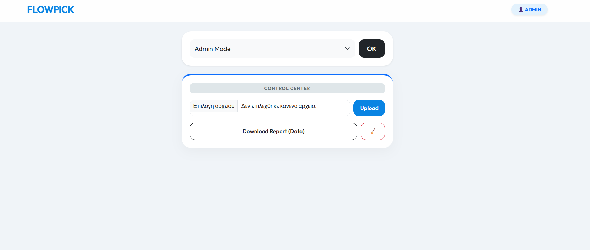

# 📦 FlowPick Systems | Warehouse Order Management

A modern, lightweight, and mobile-friendly web application designed to streamline warehouse picking operations. **FlowPick** bridges the gap between office administration and floor operations by providing real-time order tracking and assignment.


## 🚀 Key Features
- **Smart Dashboard:** Real-time overview of all pending and completed orders.
- **Dynamic Picking:** Pickers can self-assign orders ("Take" feature) to avoid double-work.
- **CSV Integration:** Bulk upload orders directly from warehouse exports.
- **Data Analytics:** One-click CSV export of daily picking performance for administrative review.
- **Responsive Design:** Premium UI built with the 'Outfit' typeface, optimized for mobile warehouse scanners and smartphones.

## 🛠️ Tech Stack
- **Backend:** Python & Flask
- **Database:** SQLite3 (Serverless & Lightweight)
- **Frontend:** HTML5, CSS3 (Custom Glassmorphism UI), Bootstrap 5

## 📸 Preview
**

## ⚙️ Installation & Setup
1. **Clone the repository:**
   ```bash
   git clone [https://github.com/YOUR_USERNAME/flowpick-systems.git](https://github.com/YOUR_USERNAME/flowpick-systems.git)
   cd flowpick-systems